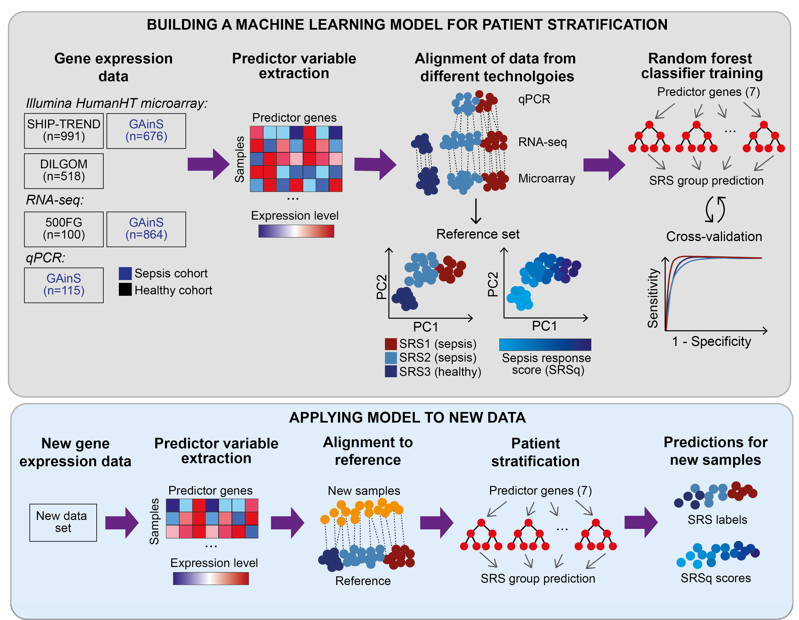

<!-- README.md is generated from README.Rmd. Please edit that file -->

# SepstratifieR

<!-- badges: start -->
<!-- badges: end -->

The goal of SepstratifieR is to stratify patients with suspected
infection into groups with different molecular characteristics. This is
done based on the expression level of 7 genes measured from whole blood.

License: MIT + file LICENSE

## Installation

You can install the development version of SepstratifieR from
[GitHub](https://github.com/) with:

``` r
# install.packages("devtools")
devtools::install_github("jknightlab/SepstratifieR")
```

## Details

### Background

This package is designed to stratify patients with suspected infectious
disease into different molecular groups based on a sample of their gene
expression from whole blood. These molecular groups are defined based on
a signature of 7 genes, and are referred to as sepsis response signature
(SRS) groups.

There are three SRS groups, which are as follows:

SRS1 = Composed of sepsis patients with an immunosupressed profile.
These individuals are often at high risk of mortality. SRS2 = Composed
of sepsis patients with an immunocompoetent profiles. These individuals
are at lower risk of mortality. SRS3 = Formed of healthy individuals or
patients with mild infection.

For more information on how SRS groups were originally defined, please
refer to the following publications:

<https://doi.org/10.1016/S2213-2600(16)00046-1>
<https://doi.org/10.1164/rccm.201608-1685OC>

### The stratification algorithm

To perform stratification on a group of patient samples (i.e. the user’s
input), SepstratifieR first aligns the input samples to a reference data
set containing gene expression profiles from healthy individuals and
sepsis patients. This alignment is performed using the mutual nearest
neighbours (mNN) algorithm for batch correction. This has the purpose of
bringing the predictor variables to the desired scale. Next, the samples
are classified into SRS groups based on a previously trained random
forest model. In addition, each sample is also assigned a quantitative
sepsis response score (SRSq) based on a second random forest prediction
model.

This score (SRSq) goes from 0 to 1. Patients with SRSq close to zero are
likely to be healthy, while patients with SRSq close to one are at high
risk.

The diagram below describes how the models used by SepstratifieR were
built (top panel) and how the stratifyPatients() function performs
alignment and classification (bottom panel):



### Input format

The input expected by this function is a data.frame object with rows
corresponding to individuals/samples and columns corresponding to genes.
This data.frame must contain at least the following seven columns:
ENSG00000152219, ENSG00000100814, ENSG00000127334, ENSG00000131355,
ENSG00000137337, ENSG00000156414, and ENSG00000115085. If more columns
are present, they will simply be ignored.

We recommend removing any technical batch effects from the input data
set before calling this function. In addition, the predictor variables
should have a roughly symmetric distribution. Thus, a transformation
step is often useful. While this is often not a problem for microarray
data sets, we recommend log-transforming any RNA-sequencing and qPCR
data before prediction.

## Example code

Below is a basic example which shows you how to use this package to
stratify a small set of patients into sepsis reponse groups:

``` r
# Load package
library(SepstratifieR)

# Load test data set
data(test_data)

# Stratify patients
predictions <- stratifyPatients(test_data)
#> 
#> Fetching predictor variables...
#> 
#> Aligning data to the reference set...
#> Number of nearest neighours set to k=20
#> Identifying potential outlier samples...
#> Stratifying samples into sepsis response signature (SRS) groups...
#> Assigning samples a qunatitative sepsis response signature score (SRSq)...
#> ... done!
```

``` r
predictions
#> SepsisPrediction
#> 
#> 25 samples
#> 7 predictor variables
#> 
#> Predictor variables: ENSG00000152219, ENSG00000100814, ENSG00000127334, ENSG00000131355, ...
#> Sample names: S1, S2, S3, S4, ...
#> SRS: SRS3, SRS3, SRS1, SRS3, ...
#> SRSq: 0.07322879, 0.1849735, 0.8394905, 0.08564241, ...
```

## Contact

Eddie Cano-Gamez: <ecg@well.ox.ac.uk>
